# A Walk Through a Generated Application

Every screen below belongs to [`models/test-app`](../models/test-app), a small e-commerce
backoffice. Nobody wrote its SQL, its policies or its React: the model is a handful of JSON
files, and `uni-biz-kit models/test-app` turns them into a Supabase backend and a
React-Admin application. See [Model.md](Model.md) for the model files and
[USAGE.md](USAGE.md) to run this yourself.

This is a tour of the highlights, not a reference — each section links to the document that
explains the feature in full.

## Custom pages on top of the generated stack

The generated application is an **admin backoffice**, but the model can add hand-written
MDX/JSX pages served by the same app and the same backend. Pages under the public route read
data through the Supabase `anon` role, so a storefront or a portal needs no login; pages under
the private route are guarded by the router and by the `authenticated` role.

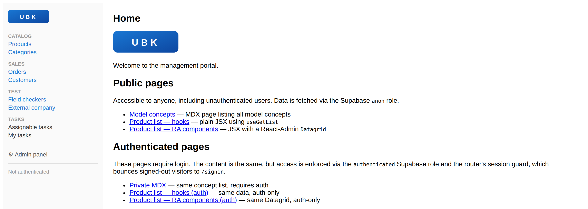

→ [Frontend.md](Frontend.md#custom-pages-mdx--jsx)

## Authentication nobody wrote

Sign-in, registration, password reset and single sign-on come with the application. The model
declares whether self-registration is allowed and which role new users get; if `sso` is
enabled, the same form offers Kerberos/Keycloak login and maps JWT claims to roles. Roles,
per-concept and per-field access rules become PostgreSQL **row-level security policies**, so
what a user may read or write is enforced by the database, not by the UI.

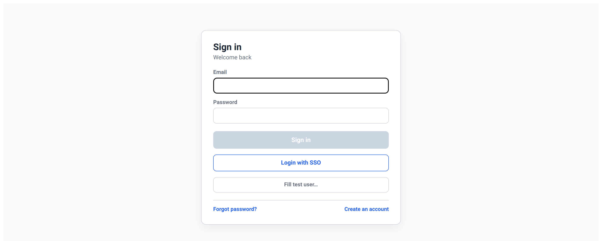

→ [Security.md](Security.md), [SingleSignOn.md](SingleSignOn.md)

## Every concept gets a list

Each concept becomes a table and a full list view: search, filters, column selection, sorting,
pagination, CSV import/export and inline quick edit. The presentation model decides which
columns appear and in which order (`"product": "!>price, sku, !details"` produced this one),
and the menu groups concepts the way the business sees them.

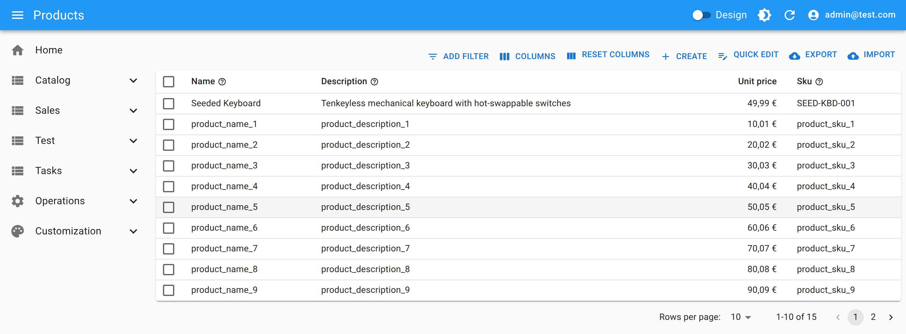

→ [Frontend.md](Frontend.md), [Backend.md](Backend.md#concepts)

## Editing many records at once

**Quick edit** opens the rows the list is currently showing — same filters, same sort, same
columns — as an editable grid: one editor per field type, foreign keys as searchable selects,
calculated and read-only fields greyed out, rows the user may not touch locked with the reason.
Rows can be added or duplicated inline, and the table copies to and pastes from a spreadsheet.
Everything is saved in one batch, with per-row errors reported in place — including the ones
the database itself rejects.

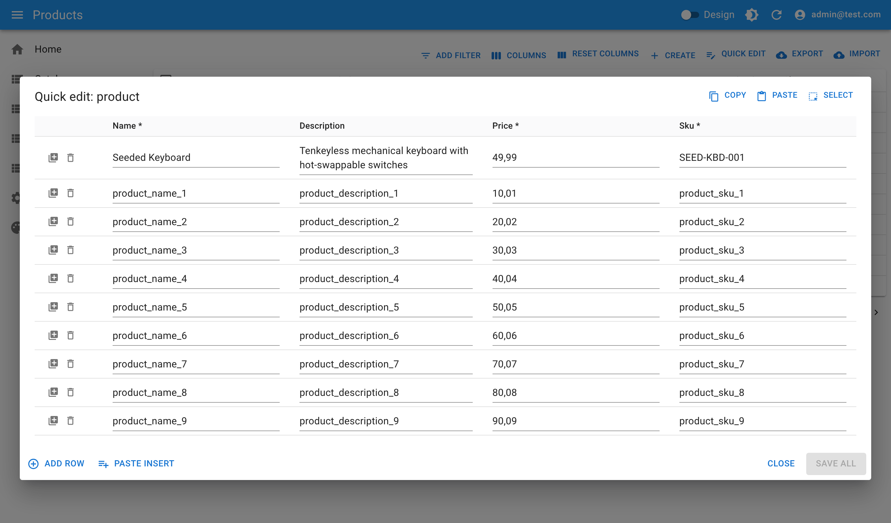

→ [Frontend.md](Frontend.md#inline-quick-edit)

## …and a form that matches its fields

Field types drive the form: `markdown` brings an editor with live preview, `decimal` with
subtype `money` renders as currency, `enum` becomes a select, `boolean` a switch. Constraints
declared once (`required`, `unique`, `min`/`max`, `min_length`) are validated in the browser
*and* enforced by the database. Calculated fields — SQL expressions, `rollup(...)` aggregates,
`copy(...)` snapshots — arrive read-only, and CSV [validations](Backend.md#validations-validationscsv)
restrict combinations such as country → province → city.

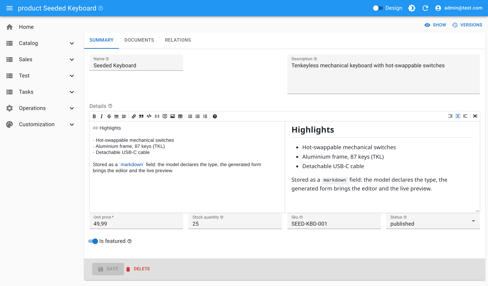

→ [Backend.md](Backend.md#field-types)

## Documents, kept by version

A concept can declare document slots by tag (`img_s`, `img_m`, `datasheet`). Files live in
Supabase Storage buckets protected by the same access rules as the record. With
`documents.versioned`, replacing a file does not overwrite it: each upload becomes a new
version, the history stays available and any earlier version can be restored.

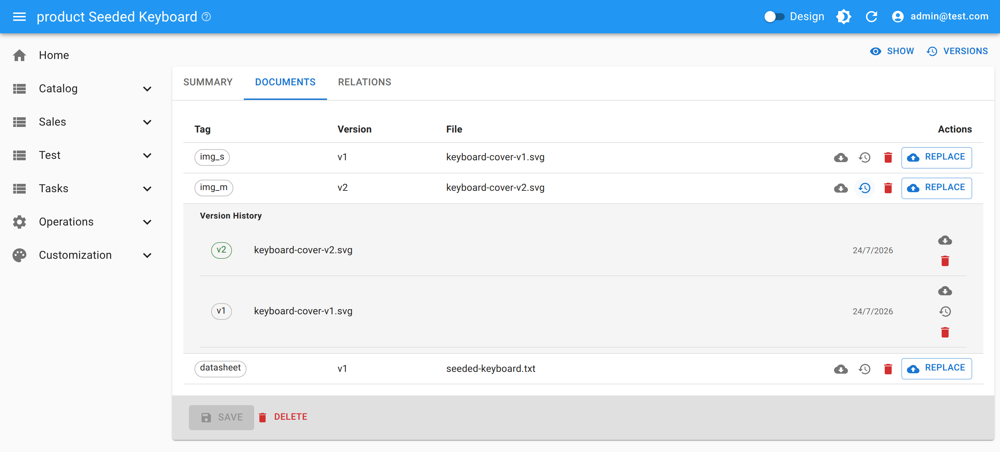

→ [Backend.md](Backend.md#concept-properties)

## Nothing is lost: record history

Concepts marked `versioned` get an immutable audit trail written by database triggers: every
insert, update and delete of fields, relations and documents, with the author and the
transaction that produced it. The aggregate is browsable from any edit or show view — a child
row's change shows up under its parent — and a previous state can be restored from there.

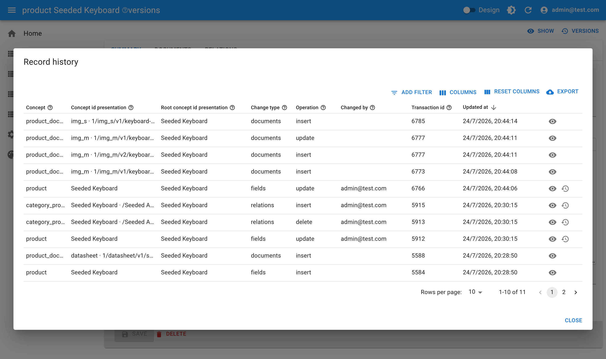

→ [Backend.md](Backend.md#record-history-and-versioning)

## Workflows and server-side rules

`workflow.jsonc` turns a concept into a state machine. States declare which roles own them and
which may reassign the task, and the generated UI shows the lifecycle inline. Transitions run
the business rules bound to them: this order's total is a `rollup` over its items, and its
shipping cost is written by a FEEL rule
(`if db.order.total_amount >= 60 then 0 else 6`) executing in an edge function that the
frontend cannot bypass. Addresses come from a `prefill` field that copies a saved customer
address into the order.

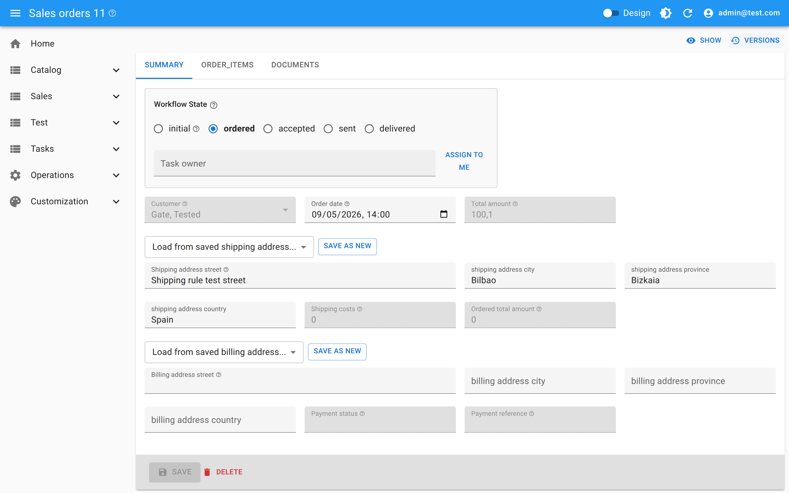

→ [Workflow.md](Workflow.md), [Backend.md](Backend.md#business-rules-rulesjsonc)

## Work queues for the people involved

From the same declaration the application derives task views: what the current role may act on,
and what has been assigned to the signed-in user. Assignment is a click, and the workflow rules
decide who is allowed to make the next move.

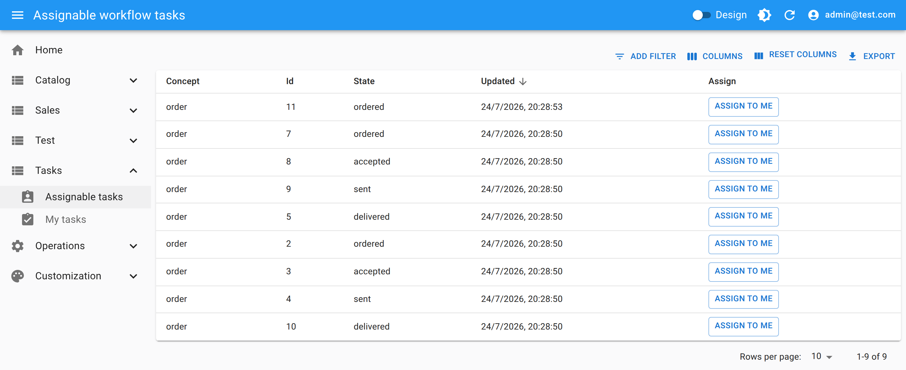

→ [Workflow.md](Workflow.md#task-pages)

## Integrations you can operate

An integration declares a target concept, a cron schedule, a JavaScript connector and a FEEL
mapping from the external payload to model fields. **The connector runs on the backend, never
in the browser**: the cron schedule lives in the database and invokes a generated edge
function, which loads the model's JavaScript and calls it **page by page**. Each call receives
the durable **checkpoint** of the last successful run, so the source returns only the records
changed since then, plus a cursor to ask for the next page until the run is complete — a lease
keeps two runs from overlapping. Every received item goes through the FEEL mapping and is
upserted by `_external_id`, records the source reports as removed follow the declared
`on_removed` policy, and the checkpoint only advances once every page has succeeded. Operators
get the run history, the counters and buttons to run now or reset the checkpoint — the same
mechanism the model uses to expose its own [action functions](Backend.md#action-functions) on
list, edit and show views.

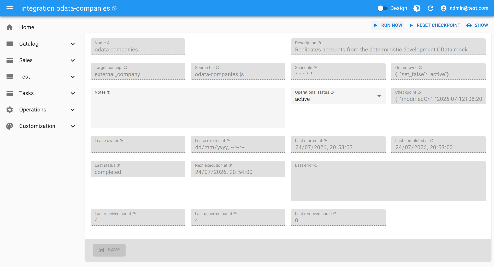

→ [Integrations.md](Integrations.md)

## Design mode: customize without touching the code

With design mode on, the running application becomes its own editor: menus, list columns, form
fields, labels, widths and workflow-state visibility can be changed in place. The result is a
presentation overlay — during development it is saved as a role-scoped
`presentation-custom-NN.jsonc` file in the model, and in production each user's own design is
stored in the database for administrators to review.

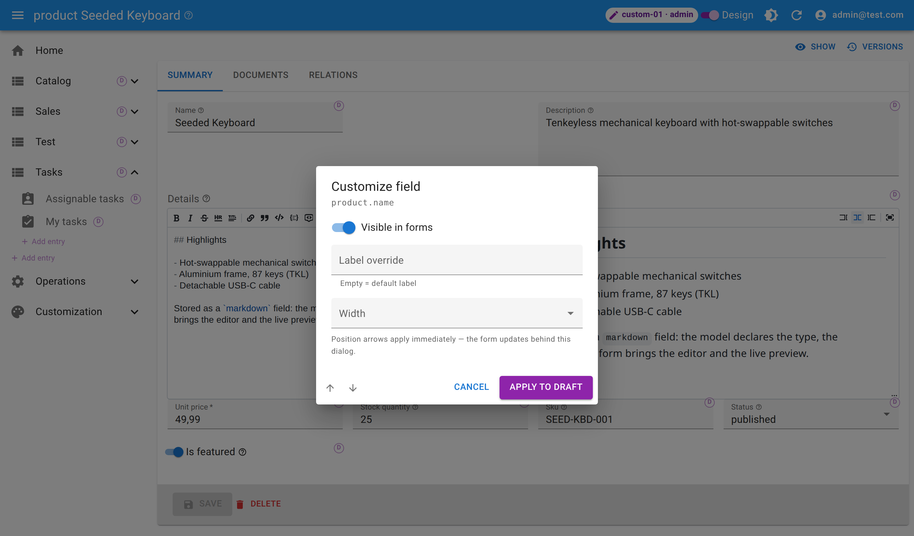

→ [Frontend.md](Frontend.md#design-mode)

## It all comes from this

The list, the form, the storage buckets, the audit trail and the policies behind them are
generated from declarations like this one:

```jsonc
{
  "name": "product",
  "description": "A product available for sale in the e-commerce platform",
  "versioned": true,
  "id_presentation": { "fields": ["name"] },
  "documents": { "enabled": true, "versioned": true, "tags": ["img_s", "img_m", "datasheet"] },
  "fields": [
    { "name": "name", "type": "string", "required": true, "min_length": 2, "max_length": 100 },
    { "name": "details", "type": "markdown" },
    { "name": "price", "type": "decimal", "subtype": "money", "required": true, "precision": 10, "scale": 2, "min": 0.01 },
    { "name": "sku", "type": "string", "required": true, "unique": true },
    { "name": "status", "type": "enum", "enum_values": ["draft", "published", "archived"], "default": "draft" },
    { "name": "categories", "type": "relation_to_many", "target": "category" }
  ]
}
```

Change the model, regenerate, and the whole stack follows — including the parts nobody wants
to keep in sync by hand.

→ [Browse the full model](../models/test-app) · [What a model can express](Model.md#capabilities)
