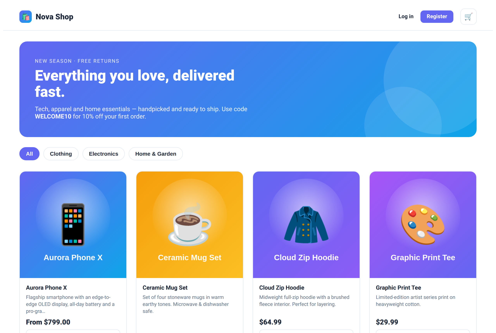
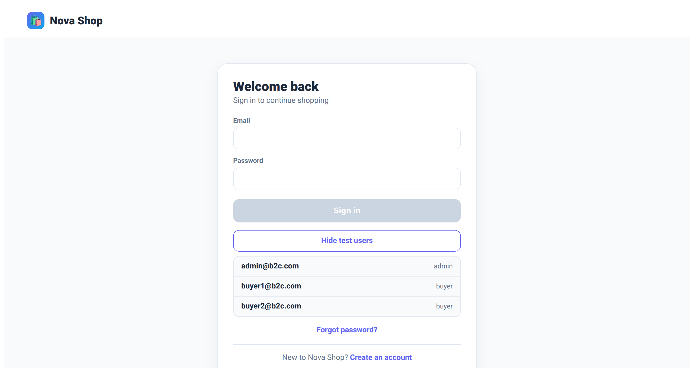
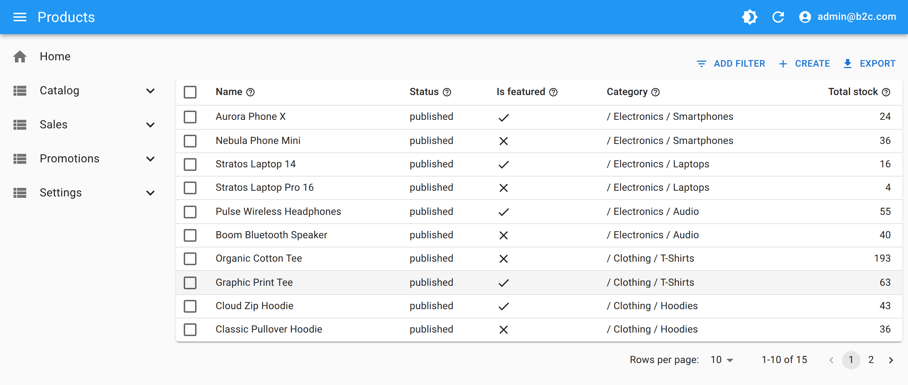
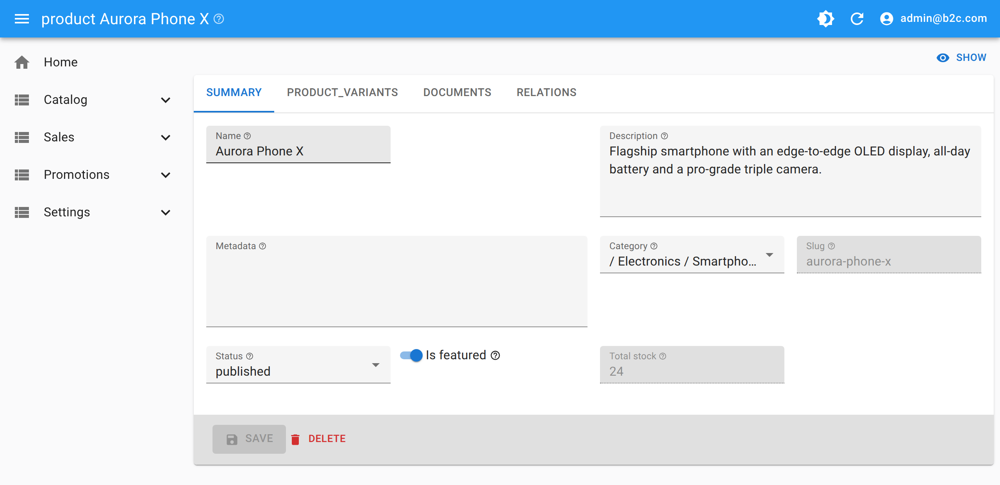

# UniBizKit

**UniBizKit** turns a declarative model into a complete, production-deployable business
application. You describe your business — concepts, security roles, presentation and
workflows — in a handful of JSONC files, and UniBizKit generates:

- a **Supabase (PostgreSQL)** backend — schema, row-level security policies and edge functions;
- a **React-Admin** admin backoffice — full CRUD for every concept, wired to the backend;
- scripts for local development and for **immutable, versioned docker-compose deployments**.

The model is the single source of truth: schema, security, admin UI and business logic are
all derived from it, so they can never drift apart. Because correctness and security are
enforced by the generated backend — not by hand-written code — an AI agent (or a functional
user) can safely build the whole application just by writing its model.

The generated interface is the **admin backoffice**. A good compromise is to keep that
generated backoffice for administering data and to hand-write a **custom interface just for
the end user** (MDX/JSX pages on top of the same backend) — you get a tailored user
experience where it matters, without rebuilding the admin side or the security behind it.

[Source code and documentation on GitHub →](https://github.com/gjimher/uni-biz-kit)

## Live demos

- [**B2C shop**](/b2c/) — a customer-facing storefront (custom MDX/JSX) backed by the
  generated React-Admin backoffice. Sign in with the "fill test user" picker on the login
  form.
- [**Intranet**](/intranet/) — an employee portal covering people, time & absence, an IT
  helpdesk and internal content, with each concept scoped to the role that owns it (HR, IT,
  employee).

## A walk through the B2C demo

A small set of JSONC files defines the whole B2C application: concepts (products, orders,
customers…), security roles, presentation and an order workflow. From that model, UniBizKit
generates the Supabase backend, its row-level security policies and the React-Admin
backoffice — no SQL or React written by hand. On top of that generated stack, the model
author adds a custom storefront for customers. Both talk to the same backend, which enforces
the same rules for everyone.

### Product catalog

The storefront is a custom MDX/JSX interface built for shoppers. It reads its data through
the same backend as the admin side — categories, variants and prices all come from the
concepts and their seed data, declared once in the model.

### Sign in with seeded roles

Roles and their sample users are declared in the model, and every generated login form
ships a "fill test user" picker — no credentials to remember. Pick `admin` to manage the
whole catalog, or a `buyer` account to shop as a customer; each lands in exactly the app its
security rules allow.

### A backoffice you never wrote

Signing in as `admin` opens the generated React-Admin backoffice — list, search, filter,
create and export views for every concept, laid out from the presentation config. The menus,
the columns and the row-level policies deciding what each role may see and touch are all
generated from the model.

### Editing a record

Open any row and you get a complete edit form: fields typed from the concept, related
records (variants, prices, categories) wired in, and the model's validations enforced both
on the form and in the database.

